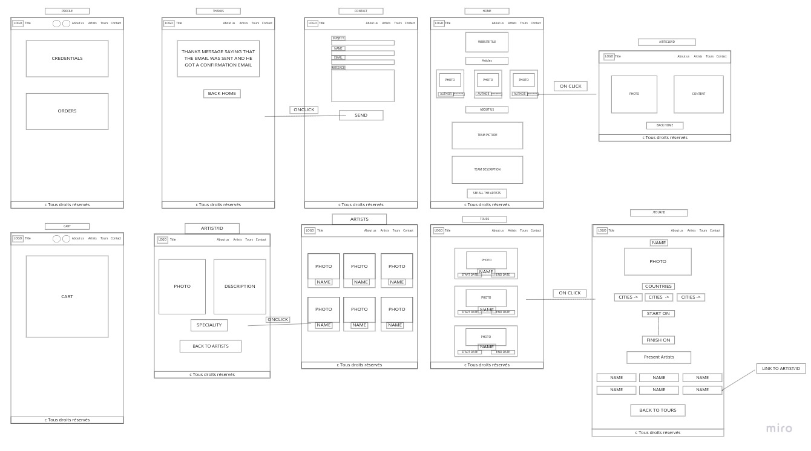
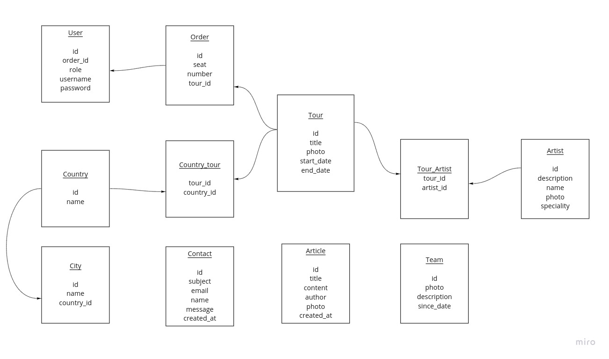
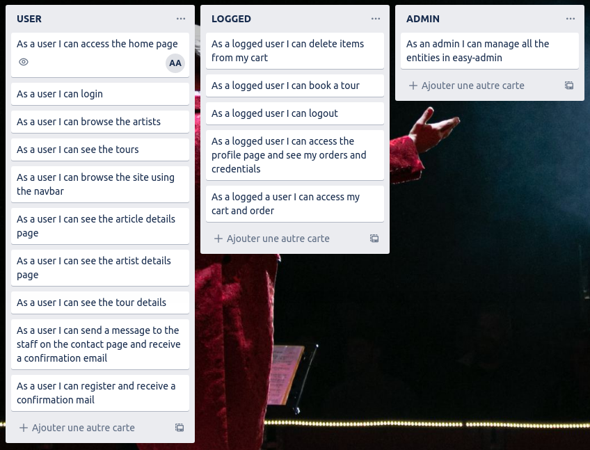

#WILD CIRCUS

##### A Showcase website to represent the tours, artists and articles of this circus.

##How to use ?
###(RECOMMENDED)
1- `composer install`

2- import the database using PHPMyAdmin with the script in /resources

2- create a .env.local and paste the .env inside it without forgetting to complete the database user, pwd and name of the database
###(OR)

1- `composer install`

2- create a .env.local and paste the .env inside it without forgetting to complete the database user, pwd and name of the db

2- `php bin/console doctrine:database:create`

3- `php bin/console make:migration`

4- `php bin/console doctrine:migrations:migrate`

## Technos

* HTML
* CSS
* PHP
* Twig
* Symfony

## Functionalities

####Front
* Nav-bar
    * Logo Wild Circus (Home)
    * Login
        * (if logged)
        * Logout
        * Profile
        * Cart
    * About us
    * Artists
    * Tours
    * Contact
* Home
    * Latest Articles
        * Display the 3 most recent articles
        * Button Read More
            * (onclick)
            * Article details page with description
            * Button Back Home
    * About Us
        * Team infos
* Artists
    * Display all Artists with photos and names
        * (onclick)
        * Artist details page with description
        * Button Back to Artists
* Tours
    * Display all the Tours with photos, names and dates
        * (onclick)
        * Tour details page with dates, artists and cities
        * Button Back to Tours
            * (if logged)
            * Button Book !
* Book
    * Dropdown list of number of seats
    * Button Add to Cart
* Contact
    * Form to contact the team
    * On submit email is sent to confirm message reception
* Profile
    * Display user Credentials and Orders
* Cart
    * Display all items added by user into cart
    * Button Order (send session data to database)
* Register
    * Form for user to register, default ["ROLE_USER"]
    * On submit, email is sent to confirm account creation
* Login
    * Form for user to login
* Footer 
    * Copyrights
    
####Back
Can be accessed with /admin and with ["ROLE_ADMIN"]
* Easy-Admin
    * All entities can be managed

## WireFrame

## CDM

## User Stories

